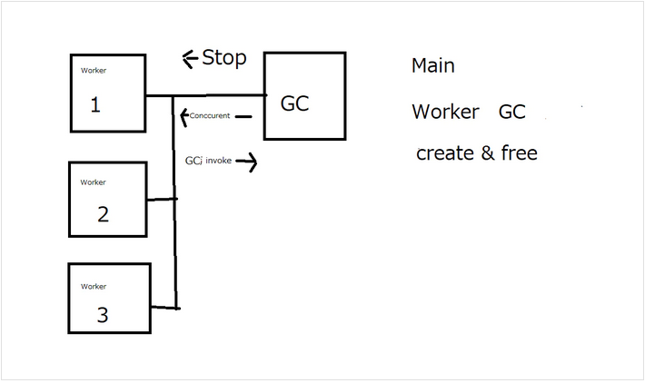
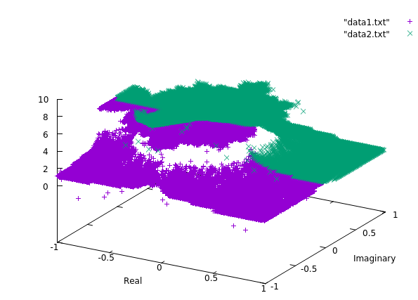
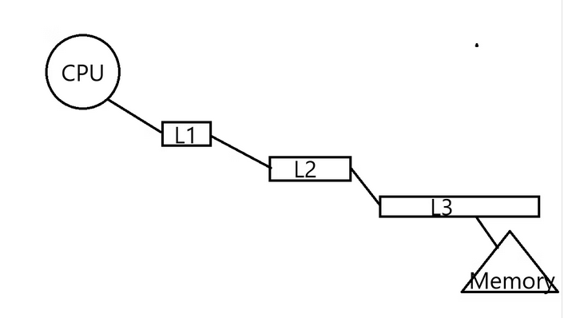
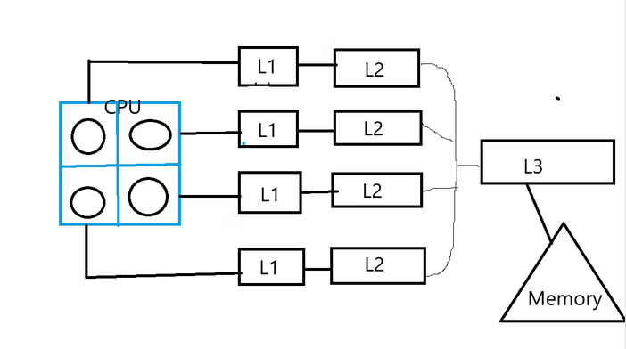
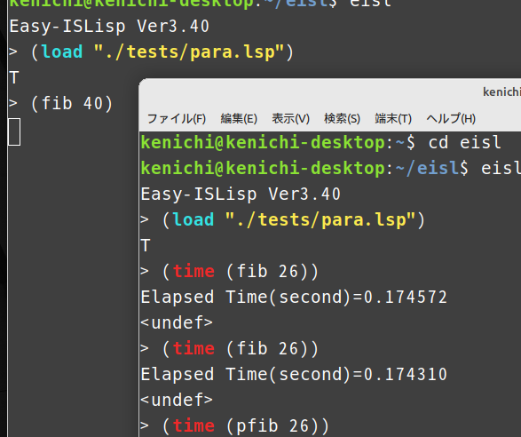

# Thread Parallel functions


# Spec

- (mt-let form body)  

```
form   ((var1 sexp1)(var2 sexp2)...)
```
- (mt-call fun arg ...)
eval (fun arg ...) with paralell

- (mt-exec arg ...)
execute (progn arg ...) with paralell

- (mt-lock arg ...)
execute (prgn arg ...) with mutex. 

```
pthread_mutex_lock()
execute arg ...
pthread_mutex_unlock()
```

## example

```
(defun pfib (n)
    (mt-let ((a (fib (- n 1)))
             (b (fib (- n 2))))
        (+ a b)))

(defun fib (n)
    (the <fixnum> n) 
    (cond ((= n 0) 0)
          ((= n 1) 1)
          (t (+ (fib (- n 1)) (fib (- n 2))))))

(defun ptarai (x y z)
    (the <fixnum> x)(the <fixnum> y)(the <fixnum> z)
    (if (<= x y)
        y
        (mt-call #'ptarai (tarai (- x 1) y z)
                          (tarai (- y 1) z x)
                          (tarai (- z 1) x y))))

(defun tarai (x y z)
    (the <fixnum> x)(the <fixnum> y)(the <fixnum> z)
    (if (<= x y)
        y
        (tarai (tarai (- x 1) y z)
               (tarai (- y 1) z x)
               (tarai (- z 1) x y))))

(defun pcount (n)
    (mt-exec (count1 1 (div n 2))
             (count1 (+ (div n 2) 1) n)))

(defun count (n)
    (count1 1 n))

(defun count1 (m n)
    (for ((i m (+ i 1)))
         ((= i n) t)
         (sin (cos (tan i)))))

```

# Thread pooling
source code syntax.c line 2546

mt-let... f_mt_let
mt-call.. f_mt_call
mt-exec.. f_mt_exec
mp-lock.. f_mt_lock

queue[] = 1,2,3,... worker_count

worker_count = core_count - 1(main + GC);

core_count is count of CPU's multicores
e.g. icore5 hexa core => 6

initital
queue  [1,2,3,4]  hexa core
queue_pt = 4;

eval_para(arg)
dequeue [2,3,4]
queue_pt = 3
main thread send signal to worker1 thread.
worker1 eval(arg) -> para_output[1]=result.
worker1 send signal to main thread.
enqueue [2,3,4,1]
queue_pt = 4




## Example
see example/mandelbrot.lsp




# Parallel Lisp: Why is it effective on ARM but not on Intel and AMD
## Please note:
The following discussion is purely hypothetical and has not been empirically validated. It contains speculation, so please keep that in mind.

## Background:
Over the past few months, I've been working on adding parallel functionality to my custom Easy-ISLisp. I've tackled issues related to thread safety and concurrent garbage collection, enabling parallel operation in both the interpreter and compiler. However, I've noticed that while the ARM-based CPU in the Raspberry Pi 400 performs well with parallelism, parallel processing can actually be slower on Intel's iCore and AMD's Ryzen processors. I've been pondering the reasons behind this discrepancy for a while, and I believe I've finally reached an understanding, so I've decided to document my thoughts.

## Instances of Slower Parallel Performance:
Easy-ISLisp comprises both an interpreter and a compiler. Moreover, the compiler includes optimizations that generate fast and compact code using type inference. However, the performance of parallel processing differs between Intel and AMD processors:

- Interpreter: ✘ Parallel processing is slower.
- Compiler: ✘ Parallel processing is slower.
- Optimized Compilation: ✔ Parallel processing is faster.

The code used for testing involves benchmarking Fibonacci number calculations using recursive computation.

## L3 Cache:
Upon investigation, I discovered that the ARM CPUs used in the Raspberry Pi have only L1 and L2 caches, lacking an L3 cache. On the other hand, Intel and AMD CPUs feature an L3 cache, which has been trending towards larger capacities in recent years.



The L1 cache is closest to the CPU and provides high-speed access. If data isn't found in the L1 cache, the CPU searches the faster L2 cache. If not found there either, it looks in the L3 cache, and if all else fails, it retrieves data from memory. Processors optimize speed by enhancing and expanding these caches.

## Issues with Shared Cache in Multi-Core Systems:
Each core has its own L1 and L2 caches, but the L3 cache is shared among all cores. Even mainstream Ryzen processors have a sizable 16MB L3 cache, designed for both performance and capacity enhancement. In a single-core scenario, this can increase cache hit rates and speed up operations. However, the situation changes when multiple cores operate in parallel, as they have different memory views. If data isn't found in the L3 cache, it must be reloaded from memory. Additionally, since they access common memory, contention issues are more likely, particularly in memory-shared parallelism using the Pthread library.



Conversely, in a multi-process setup, this issue is not observed. The image below demonstrates two processes independently calculating Fibonacci numbers. The speed remains unaffected by the computations of other cores. Multi-process setups have separate memory spaces, making cache update contention less likely.



## Current Conclusions:
The parallel functionality of Easy-ISLisp relies on POSIX threads (Pthread) for multi-threaded, multi-core parallelism. Shifting to a multi-process approach could potentially enhance parallel performance, but implementing access to global variables in Lisp would require intricate solutions. It would also necessitate a mechanism for sharing programs across all processes.

I believe that Intel and AMD will undoubtedly address this parallelism issue, so I'll patiently await those developments.

I lack specialized knowledge about CPUs. I would appreciate your opinions on the aforementioned hypotheses. Please share your insights in the issues section. Thank you in advance.
