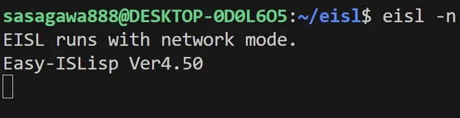
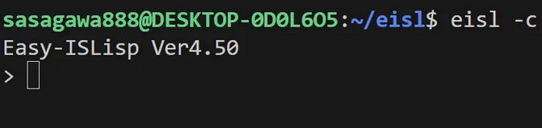
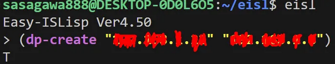
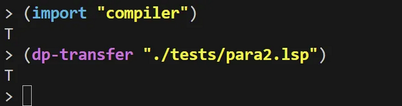
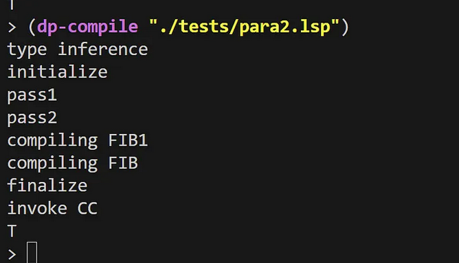
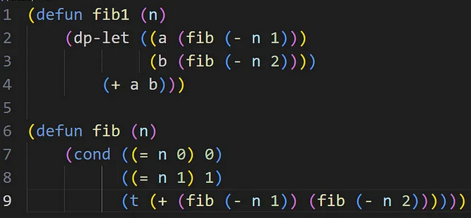
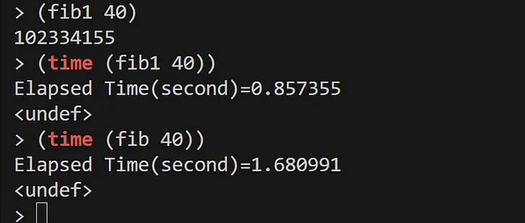
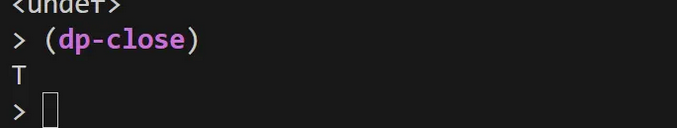

# Distributed Parallel functions


# Invoke 
eisl -n on child machine terminal.
EISL runs with network mode. 


eisl on parent machine terminal.
and (dp-create ) to establish TCP/IP between child Lisp.

# Spec

- eisl -n: Launches child Lisps in network mode with the -n option.

- (dp-create c0 c1 …cn): Provides IP addresses of child machines to establish TCP/IP communication with the parent Lisp.

- (dp-call fun a0 a1 ... an): Distributed parallel version of the call syntax.

- (dp-exec a0 a1 ... an): Distributed parallel version of progn

- (dp-and a0 a1 ... an): Paralle version and.
Executes arg1 to argn in parallel in child Lisps.
If one of arg returns nil stops exections and return nil,
else  returns the result of the first execution.

- (dp-or a0 a1 ... an): Paralle version or.
If one of arg returns non-nil stops exections and return result,
else  returns the result of the first execution.

- (dp-transfer fn): Transfers file fn to all child machines from the parent machine.

- (dp-compile fn): Compiles file fn on both parent and child machines.

- (dp-load fn): Loads file fn on both parent and child machines.

- (dp-eval n sexp): Evaluates S-expression sexp on the nth child Lisp for testing.

- (dp-report str): Display string on parent terminal.

- (dp-close): Sends termination command to child machines and closes communication.

- (dp-halt): Sends termination command to child machines and closes communication.
  Shutdown OS in child machine.


## example

```
(defun pfib (n)
    (dp-let ((a (fib (- n 1)))
             (b (fib (- n 2))))
        (+ a b)))

(defun fib (n)
    (the <fixnum> n) 
    (cond ((= n 0) 0)
          ((= n 1) 1)
          (t (+ (fib (- n 1)) (fib (- n 2))))))

(defun ptarai (x y z)
    (the <fixnum> x)(the <fixnum> y)(the <fixnum> z)
    (if (<= x y)
        y
        (dp-call #'ptarai (tarai (- x 1) y z)
                          (tarai (- y 1) z x)
                          (tarai (- z 1) x y))))

(defun tarai (x y z)
    (the <fixnum> x)(the <fixnum> y)(the <fixnum> z)
    (if (<= x y)
        y
        (tarai (tarai (- x 1) y z)
               (tarai (- y 1) z x)
               (tarai (- z 1) x y))))

(defun pcount (n)
    (dp-exec (count1 1 (div n 2))
             (count1 (+ (div n 2) 1) n)))

(defun count (n)
    (count1 1 n))

(defun count1 (m n)
    (for ((i m (+ i 1)))
         ((= i n) t)
         (sin (cos (tan i)))))


;(dp-create "xxx.xxx.xxx.xxx" "yyy.yyy.yyy.yyy")
;(primep* 100000000000031)
(defun primep* (n)
    (cond ((= n 2) t)
          ((= (mod n 2) 0) nil)
          (t (let* ((limit (isqrt n))
                    (span (div limit 2)))
                 (dp-part nil (coprimep n 3 span)
                              (coprimep n (near-odd span) limit))))))

(defun near-odd (n)
    (if (= (mod n 2) 0)
        (- n 1)
        n))


(defun coprimep (n s e)
    (cond ((> s e) t)
          ((= (mod n s) 0) nil)
          (t (coprimep n (+ s 2) e))))

(defun primep (n)
    (cond ((= n 2) t)
          ((= (mod n 2) 0) nil)
          (t (coprimep n 3 (isqrt n)))))

(import "unistd")

(defun bar (x y)
    (dp-exec (uoo x) (uoo y)))

(defun uoo (x) 
    (let ((stm (create-string-output-stream)))
        (format stm "test1 ~A ~%" x)
        (dp-report (get-output-stream-string stm))
        (sleep 1)
        (format stm "test2 ~A ~%" x)
        (dp-report (get-output-stream-string stm))
        (sleep 1)
        t))

(defun woo (x y)
    (dp-part nil (uoo x) (uoo y)))

```









