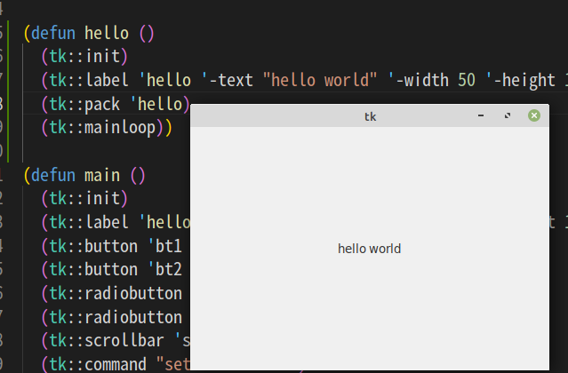
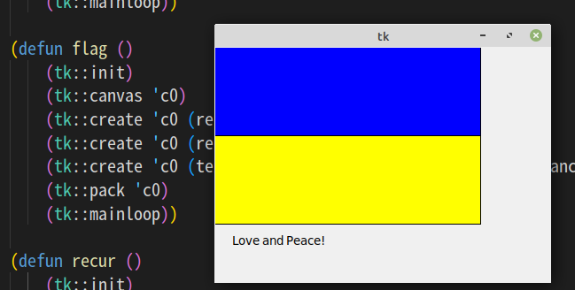

# Tcl/Tk

Library to use the Tk GUI.

Under construction.

# Usage

## Install Tcl/Tk

*Linux*: `sudo apt install tcl-dev tk-dev`

*macOS*: `brew install tcl-tk`

## Compile

```
eisl -c
(compile-file "library/tcltk.lsp")
```

## Import

```lisp
(import "tcltk")
```

# Functions

## label

(tk::label object option)


## button

(tk::button object option)

## radiobutton

(tk::radiobutton object option)


## checkbutton

(tk::checkbutton object option)


## listbox

(tk::listbox object option)

## menu

(tk::menu objects option)

objects e.g. .m.m1 (in tcl) -> '(m m1)   m is parent obj, m1 is child obj

#### add 
add menu-object menu.

(tk::add objects class option)

objects e.g. .m.m1 (in tcl) -> '(m m1)  m is parent obj, m1 is child obj

class

```
cascade
checkbutton
command
radiobutton
separator
```

## scrollbar

(tk::scrollbar object option)

## canvas

(tk:canvas object option)

#### create
(tk::create object class option)

class

```
(line parameter)  
(oval parameter)
(arc parameter)
(rectangle parameter)
(polygon parameter) 
```

## pack

(tk::pack object1 object2 ... objectN)


## bind

(tk::bind object event S-expression)

e.g.
```
 (tk::bind 'c0 "<Button-1>" `(bar %x %y))
```

## command

(tk::command str)

```
> (tk::init)
NIL
> (tk::command "expr 2*3")
expr 2*3
6
T
> 
```


## option


### RGB

-fg #(R G B)   R G B is integer 

### font

e.g.
-font '((ＭＳ ゴシック) 16 underline)


# Example

```lisp

(import "tcltk")

(defun hello ()
  (tk::init)
  (tk::label 'hello '-text "hello world" '-width 50 '-height 15)
  (tk::pack 'hello)  
  (tk::mainloop))

```




```lisp

(import "tcltk")

(defun flag ()
    (tk::init)
    (tk::canvas 'c0)
    (tk::create 'c0 (rectangle 0 0 300 100) '-fill 'blue)
    (tk::create 'c0 (rectangle 0 100 300 200) '-fill 'yellow)
    (tk::create 'c0 (text 20 210) '-text "Love and Peace!" '-anchor 'nw)
    (tk::pack 'c0)
    (tk::mainloop))


```



```lisp

(import "tcltk")

(defun recur ()
    (tk::init)
    (tk::canvas 'c0 '-width 600 '-height 600)
    (gasket #(300 0) #(0 600) #(600 600) 10)
    (tk::pack 'c0)
    (tk::mainloop))

(defun midpoint (a b)
   (let ((a0 (elt a 0))
         (a1 (elt a 1))
         (b0 (elt b 0))
         (b1 (elt b 1)))
      (vector (+ (min a0 b0) (abs (quotient (- a0 b0) 2)))
              (+ (min a1 b1) (abs (quotient (- a1 b1) 2))))))
      

(defun draw-triang (a b c)
   (let ((a0 (elt a 0))
         (a1 (elt a 1))
         (b0 (elt b 0))
         (b1 (elt b 1))
         (c0 (elt c 0))
         (c1 (elt c 1)))
      (tk::create 'c0 (line a0 a1 b0 b1 c0 c1 a0 a1) '-fill 'green)))

(defun gasket (a b c n)
    (cond ((= n 0) t)
          (t
            (draw-triang a b c)
            (draw-triang (midpoint a b) (midpoint b c) (midpoint c a))
            (gasket a (midpoint a b) (midpoint a c) (- n 1))
            (gasket (midpoint a b) b (midpoint b c) (- n 1))
            (gasket (midpoint a c) (midpoint b c) c (- n 1)) )))

```

